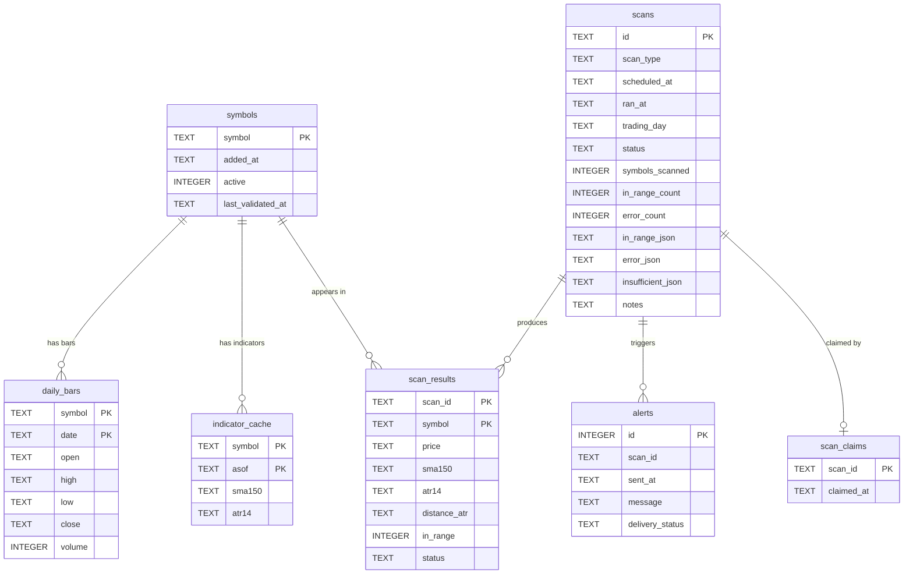

# Database Schema

The screener persists all state in a **single SQLite file** (WAL mode, single-writer). The schema is
defined inline as `_SCHEMA` in
[sqlite_repository.py](../src/screener/adapters/repository/sqlite_repository.py) — there is no ORM or
migration framework.

Two conventions worth knowing when reading the diagram:

- **Decimal-as-TEXT** — monetary/indicator values (OHLC prices, SMA150, ATR14, distance) are stored as
  `TEXT` and reconstructed to `Decimal` on read, to avoid float precision loss.
- **Relationships are logical, not FK-enforced** — `PRAGMA foreign_keys = ON` is set, but no table
  declares a `FOREIGN KEY`. The lines below are join relationships via `symbol` and `scan_id`, not
  database-enforced constraints.

## Tables

| Table | Primary key | Purpose |
| --- | --- | --- |
| `symbols` | `symbol` | The watch universe. Soft-deleted via `active = 0`; re-adds reactivate. |
| `daily_bars` | `symbol, date` | Daily OHLCV history per symbol (upserted). |
| `indicator_cache` | `symbol, asof` | Derived indicators (SMA150, ATR14) cached per symbol and as-of date. |
| `scans` | `id` | One row per scan run: schedule/run timestamps, status, counts, and JSON summary lists (in-range / error / insufficient). Indexed on `ran_at` and `trading_day`. |
| `scan_results` | `scan_id, symbol` | Per-symbol outcome for a scan: price, indicators, distance in ATRs, in-range flag, status. |
| `alerts` | `id` (autoincrement) | Notifications sent for a scan, with delivery status. |
| `scan_claims` | `scan_id` | Idempotency markers. Kept separate from `scans` so a crash after claiming but before saving blocks a duplicate re-run without polluting the diff baseline. |
| `fundamentals_snapshot` | `symbol` | Phase-4 fundamentals cache (latest-only). `payload_json` is the derived scored metrics **plus** the company profile, tagged so `Decimal`/`date` round-trip exactly; `fetched_at`/`next_earnings_date`/`source` are duplicated as columns for the §4.3 freshness rule. |
| `news_cache` | `symbol` | Phase-4 company-news cache (latest-only). `payload_json` is the list of news items; `fetched_at` drives the short-TTL (`news_cache_hours`) freshness rule. |

### Phase-4 cache (fundamentals & news)

These two tables are an on-demand per-symbol **cache**, not analytical history — retention is
latest-only (a put overwrites), mirroring the DynamoDB items `PK=FUND#<symbol>,SK=SNAPSHOT` and
`PK=NEWS#<symbol>,SK=LATEST`. The JSON payload is produced by a shared codec
([`_fundamentals_codec.py`](../src/screener/adapters/repository/_fundamentals_codec.py)) so the
SQLite and DynamoDB backends stay behaviourally identical (both pass the shared repository
contract). We persist the derived numbers we score on, never raw financial statements (PRD §10).
